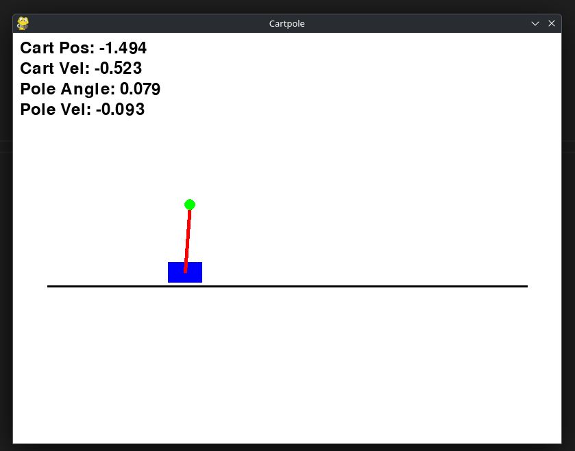

# CartPole DQN

AI learns to balance a pole on a cart using Deep Q-Network (DQN).



## Setup
```bash
python3 -m venv cartpole_env
source cartpole_env/bin/activate
pip install -r requirements.txt
```

## Usage

**Manual Play:**
```bash
python main.py
```
Use arrow keys to control cart.

**Train AI:**
```bash
python train.py
```

**Watch AI Play:**
```bash
python evaluate.py
```
Press LEFT/RIGHT to override AI decisions.

## Training Results

The AI learns to balance the pole in ~300-700 episodes. Training generates:
- `training_results.png` - Score and loss plots
- `dqn_model_final.pth` - Trained model

Target: Average score of 195+ over 100 episodes.

## Files
- `cartpole.py` - Game environment
- `dqn.py` - Neural network & agent
- `train.py` - Train the AI
- `evaluate.py` - Test trained model
- `main.py` - Manual control